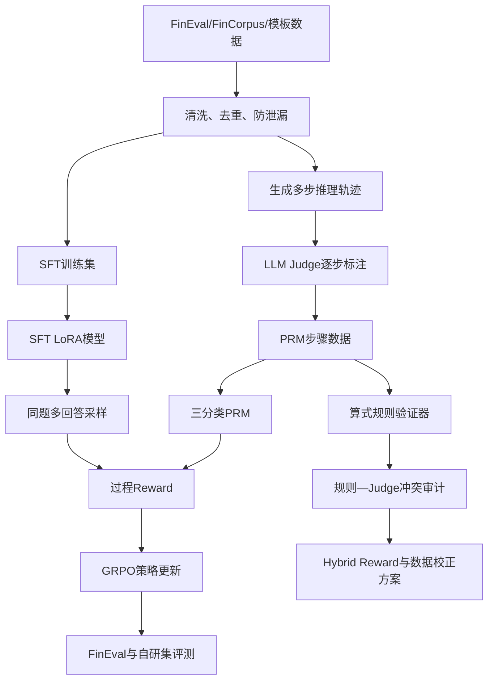

# Fin-R1 从零理解：完整流程、动机与面试讲法

## 1. 项目到底想解决什么问题

普通指令微调可以让模型学会金融问答的表达方式，但它不保证模型真的会逐步推理。模型可能出现三类问题：

1. 最终答案碰巧正确，但中间公式或逻辑错误；
2. 推理过程看起来专业，却使用了题目没有给出的条件；
3. 输出格式规范，但真实答案能力没有提高。

因此项目最初采用 `SFT → PRM → GRPO → Evaluation`：先让模型学会基本金融问答，再训练一个过程奖励模型判断每一步质量，最后用强化学习鼓励策略模型生成高奖励的推理过程。

项目后续发现：如果PRM的标签也全部来自LLM Judge，那么Reward本身可能有错误。金融计算中很多算式可以被Python确定性执行，所以又增加了规则验证器，对Judge标签进行审计。这形成当前更有辨识度的研究问题：

> 如何把确定性计算验证和语义Judge结合起来，降低金融过程监督中的标签噪声与Reward hacking？

## 2. 先理解六个核心概念

### 2.1 Base Model

基座模型是未经本项目训练的Qwen2.5-7B-Instruct。它已有通用语言和部分金融知识，但不一定遵循项目指定的逐步推理格式。

保留Base的目的，是回答“训练到底有没有比原模型更好”。如果只有SFT和GRPO，没有Base，就无法区分SFT的贡献。

### 2.2 SFT

SFT是监督微调。给模型输入问题和标准回答，用交叉熵让它模仿答案。

它解决的是“模型应该怎么回答”，优点是稳定，缺点是只能模仿训练数据，不能直接针对不可微的答案正确率或过程质量优化。

### 2.3 PRM

PRM是Process Reward Model，即过程奖励模型。它不只看最终答案，而是判断中间推理步骤是错误、部分正确还是正确。

项目把PRM做成三分类器。它的价值是把“过程质量”转换成一个连续奖励，使GRPO能够优化推理过程。

### 2.4 GRPO

GRPO是一种组相对策略优化。对同一个问题采样多个回答，在组内比较奖励高低，提高高奖励回答的概率，降低低奖励回答的概率。

相对PPO，它不需要单独训练一个庞大的Value Model，适合资源有限的推理模型后训练。但它仍然依赖Reward：Reward定义偏了，模型就会学会钻空子。

### 2.5 LLM-as-a-Judge

用更强或更稳定的模型评价回答质量。它能判断概念和逻辑，但存在偏好长回答、格式完整、措辞专业等偏差，也可能漏掉细小计算错误。

### 2.6 Rule Verifier

规则验证器从步骤中抽取算式，用受限AST执行加减乘除，比较计算结果和回答声称值。它客观、便宜、CPU可运行，但只能验证局部算术，不能判断公式是否选对、条件是否真实或金融逻辑是否成立。

## 3. 整体数据流



## 4. 第一步：SFT数据准备

对应代码：`src/data_prep_sft.py`。

### 输入

- FinEval开发集：金融考试选择题；
- FinCorpus中的考试类数据；
- 模板生成的金融推理样本；
- 可选的自生成数据。

### 为什么不能把所有数据直接混在一起

- 评测题进入训练会造成数据泄漏；
- FinCorpus混有非金融内容；
- 部分记录只有文章摘要，没有可验证答案；
- 多选题标签若被截断，会系统性污染监督；
- 数据量大不代表质量高，错误答案会直接教坏模型。

### 项目做了什么

- FinEval只使用dev训练，把val留作评测；
- 过滤非金融内容和没有可靠答案的文本；
- 统一成LLaMA-Factory的messages格式；
- 固定随机种子并切分训练/验证集；
- 生成`dataset_info.json`供训练框架注册数据。

### 目的

得到一个能够稳定训练、不会直接泄漏评测答案的金融SFT数据集。SFT在这里是后续RL的初始化模型：如果策略一开始连基本回答格式都不会，GRPO的采样质量会太差，奖励方差也会很大。

## 5. 第二步：SFT训练

对应配置：`configs/sft_lora.yaml`。

项目选择LoRA而不是全参数训练，原因是7B全参数训练显存和成本高，而领域适配通常不需要更新全部参数。LoRA在注意力和MLP投影层插入低秩矩阵，只训练少量参数。

训练完成后得到SFT Adapter。它承担三项作用：

1. 学会金融问答语言和基本术语；
2. 学会逐步回答的初始行为；
3. 为GRPO提供比原始基座更稳定的策略起点。

## 6. 第三步：生成PRM轨迹

对应代码：`src/data_prep_prm.py`。

### 为什么不能直接用标准答案训练PRM

标准答案通常只有最终选项或数字，不告诉我们哪一步出了错。PRM需要步骤级样本，所以必须先生成完整推理轨迹，再把轨迹拆成步骤。

### 流程

1. 从金融题中构造“逐步推理”Prompt；
2. 调用生成模型产生完整轨迹；
3. 用`第N步`格式切分步骤；
4. 给Judge同时提供问题、轨迹和标准答案；
5. Judge把每一步标为`-1/0/1`；
6. 过滤最终答案错误却全部步骤标正确的毒数据；
7. 生成GRPO只含问题的Prompt集，标准答案单独保存在Reward查找表中，不喂给策略模型。

最终数据为6,683条轨迹、34,183个步骤。正确标签占比很高，因此PRM训练必须处理类别不平衡。

## 7. 第四步：训练PRM

对应代码：`src/prm_train.py`。

### 旧版设计

输入`问题 + 当前步骤`，输出错误、部分正确、正确三分类。这种方法简单，但脱离历史上下文时可能无法判断“因此得到12%”是否正确。

### 新版设计

输入改为：

```text
问题
此前推理 Step1...Step(k-1)
待评估 Step k
```

同时按题目分组切分训练和验证，避免同一道题的不同步骤跨集合造成泄漏。

### 为什么使用类别权重

34,183个步骤中正确类约占89%。若直接优化accuracy，模型可能几乎全部预测正确仍得到很高分。类别权重会放大少数错误和部分正确样本的损失。

### 为什么不能只看accuracy

- `macro-F1`：三个类别等权，能检查少数类；
- `balanced accuracy`：各类别召回率的平均；
- `ECE`：模型说“90%正确”时是否真的约90%正确；
- `Brier score`：概率预测与真实标签的整体误差。

训练与评测协议同时报告少数类指标、概率校准指标和分组切分信息，避免只用总体accuracy掩盖类别不平衡。

## 8. 第五步：设计Reward

对应代码：`src/reward_finance.py`。

### 旧Reward的问题

旧版由50%格式规则和50%PRM/Judge组成。模型很容易通过增加步骤编号、单位、结论等形式获得高分。因此格式率达到100%不能证明推理变强。

### 新版Hybrid Reward

```text
Reward = 0.25答案正确
       + 0.55过程PRM/Judge
       + 0.10规则验算
       + 0.10格式
       - 0.15投机惩罚
```

- 答案奖励保证最终目标不被忽略；
- 过程奖励检查逻辑质量；
- 规则奖励检查可执行算式；
- 格式只保留低权重，防止输出完全崩塌；
- 投机惩罚针对重复步骤、多个冲突结论和异常冗长。

PRM步骤分数使用bottom-k聚合，而不是简单平均。原因是简单平均允许模型添加大量容易正确的废话来稀释一个关键错误；bottom-k更关注最薄弱的步骤。

## 9. 第六步：GRPO训练

对应代码：`src/grpo_train.py`。

对每个问题生成多个回答，Reward分别评分，再计算组内相对优势。策略提高高分回答的生成概率，同时KL项限制策略不要偏离参考模型太远。

项目还支持动态KL：前期较低KL鼓励探索，后期较高KL稳定收敛。它的动机是避免一开始限制过强学不到新策略，也避免后期漂移和语言质量下降。

仓库将旧版Reward与新版Hybrid Reward配置分开保存，便于在统一评测协议下进行对照与消融。

## 10. 第七步：评测

对应代码：`src/evaluate.py`、`src/best_of_n.py`和`src/statistical_analysis.py`。

### FinEval

测试金融选择题最终答案能力。已有结果SFT 73.15%、GRPO 73.76%，差值0.61pp，只能称基本持平或小幅变化，不能称显著提升。

### 自研金融推理集

共有48题，已补充题型、难度、可验证性和陷阱元数据。40题含可执行计算。过程Judge指标从71.43%变为86.02%，但该指标依赖Judge且样本小，因此称探索性结果。

### Best-of-N

同一问题采样N个答案，再由PRM重排。公平评测必须同时报告：

- greedy；
- 第一个随机采样；
- 随机选择候选；
- PRM选择候选；
- Oracle pass@N。

只有PRM显著优于随机选择，才能证明排序价值；Oracle表示候选生成的理论上限。

### 统计检验

逐题比较使用paired bootstrap置信区间和McNemar检验；多随机种子实验统一报告mean±std。

## 11. 第八步：规则验证与冲突审计

对应代码：`src/calc_verifier.py`、`src/build_verified_prm.py`、`src/build_conflict_audit.py`。

规则引擎用AST白名单执行算式，不使用危险的直接`eval`。它扫描2,000条轨迹、10,177个步骤，识别594个可验步骤，占5.84%。

规则和Judge有112个冲突：13个Judge正、规则负；99个Judge负、规则正。必须注意：

- Judge正、规则负可能是模型算错，也可能是解析器截断链式等式；
- Judge负、规则正经常是局部算术成立，但步骤擅自假设、选错公式或按选项反推；
- 所以冲突不等于Judge错误。

项目已完成50条模型辅助初审，37条反向冲突高度符合“局部算术正确、整体逻辑不可靠”，13条需要专业确认。它不是人工金标。

## 12. 每个关键技术决定背后的动机

| 决定 | 动机 | 防止的问题 |
|---|---|---|
| FinEval dev训练、val评测 | 保持独立测试 | 数据泄漏 |
| LoRA而非全参训练 | 控制显存和费用 | 训练成本过高 |
| 逐步轨迹而非只看答案 | 学习过程质量 | 答案碰巧正确 |
| PRM三分类 | 保留部分正确状态 | 强制二分类过粗 |
| 按题分组切分PRM | 同题步骤不能跨集合 | 验证指标虚高 |
| 类别加权与macro-F1 | 正确类占比过高 | 懒惰多数类模型 |
| 答案+过程+规则Reward | 不让单一指标主导 | Reward hacking |
| 降低格式权重 | 格式不是推理 | 只学会模板 |
| bottom-k步骤聚合 | 关注最差步骤 | 废话稀释错误 |
| 安全AST验证 | 客观执行且避免注入 | Judge漏算、任意代码执行 |
| 冲突不直接覆盖Judge | 局部计算不代表全局逻辑 | 规则误标 |
| 暂缓四组PRM重训 | 缺少金标且预算有限 | 循环自证和无效花费 |

## 13. 当前项目还缺什么

### 必需但不需要GPU

1. 把README、研究报告和面试讲稿统一成相同口径；本版本已经完成。
2. 保留50条模型辅助初审结果；已经完成。
3. 做一个5分钟演示：运行数据审计、算式验证、展示一条冲突；脚本已经具备。
4. 熟悉本教程并能解释为什么0.61pp不能叫显著提升；这是你本人需要完成的学习任务。

### 有条件再做

1. 找金融专业同学确认13条高风险冲突；
2. 获得免费GPU后比较单步/上下文PRM和Judge-only/Rule-corrected；
3. 扩充自研集至300题以上。

这些不是当前求职投递的阻塞项。

## 14. 五分钟现场演示流程

```bash
python src/audit_dataset.py --fail_on_eval_overlap
python src/calc_verifier.py --step "净利润=5000*15%=750万元"
python src/build_conflict_audit.py
python src/build_assisted_review.py
```

演示顺序：先证明数据无评测泄漏，再演示确定性算式验证，随后打开一条规则—Judge冲突，解释“算术正确不代表整步正确”，最后展示Hybrid Reward设计。

## 15. 你应该掌握的最小知识清单

- SFT、LoRA、PRM、GRPO、KL分别解决什么问题；
- 为什么Reward设计会导致Reward hacking；
- 为什么数据切分必须按题而不是按步骤；
- accuracy、macro-F1、ECE的区别；
- 为什么规则验证器不能替代Judge；
- 哪些结果已经跑出，哪些只是实现方案。

如果这六点能独立讲清楚，你就已经能够把项目作为大模型算法岗项目介绍，而不是只会运行脚本。
